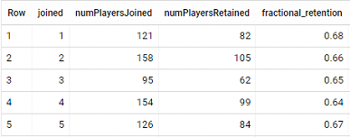
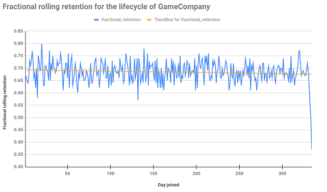
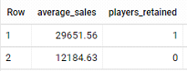
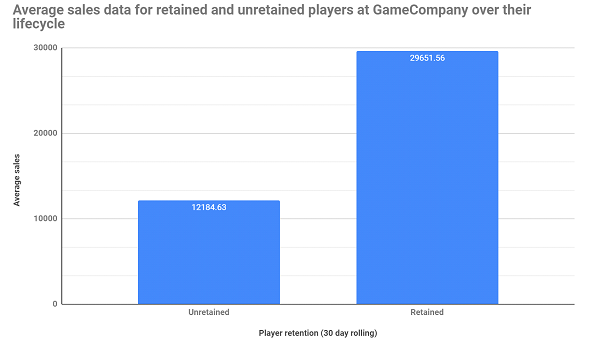
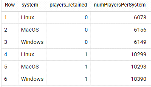
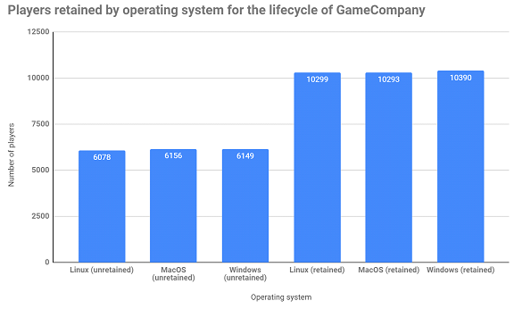

# GameCompany SQL Project

## Links

### [SQL Queries](https://github.com/Zaltaer/Project1-SQL/blob/main/sql_queries.md)

### [Google Sheets](https://docs.google.com/spreadsheets/d/1V3VOes02FlgSR_r_cANmm-z0AIjU51WMUI3h6VdIJpw/edit?usp=sharing)

## Overview

We were tasked by our manager with analyzing player, match, purchase, and item data for a mobile game company. The company is celebrating it’s 1 year anniversary and our manager has questions related to the 30 day rolling retention of players over the past year. Using our skills in SQL and Google Sheets we produced tables and graphs to illustrate our findings and to make it easier for the company to make informed business decisions in the future.

## Finding player fractional retention

First we queried the GameCompany database (specifically the player_info and matches_info tables joined together) to count the number of players who joined each day. Then we used a CASE statement to label retained players with ‘1’ and unretained players with ‘0’ and a SUM function to add up the number of players who were retained or unretained. Lastly we calculated the fractional retention of players per day by dividing the number of players retained by the total number of players who joined on that day. One thing to note is that to calculate rolling 30-day retention we needed data for 30 days or more following the day a player joined so we decided to limit dataset to 334 days with a WHERE clause to eliminate those 30 days at the end of the year for which rolling retention isn’t applicable.

 
## Representing our results visually

Next we were tasked with visually representing the 30-day rolling retention of players to determine if the company’s player retention was increasing, decreasing, or staying the same over the past year of business. Looking at the graph, and in particular the line of best fit, we can see that player retention has been fairly steady over the past year of business. Looking closer at the best fit line we can see that it has a small negative slope which indicates a very minor decrease in player retention over time but this slope is not large enough to be statistically significant. It’s worthwhile to note that there is a sharp decrease in player retention on the last 3 days which could be due to us trimming the last 30 days off the end of our dataset. I would let the business know that their strategies for customer retention have been effective over the past year.

## Average player spending for retained and unretained players

Taking our analysis a step further we were interested in determining if retained players were spending more money than unretained players in the game store. We used nested queries and a 4-way join of our GameCompany SQL tables to compute the average sale amount for a retained player compared to an unretained player. In terms of the code, our inner query contained the same SQL code as the first question for establishing retained player numbers with a CASE statement. Additionally in the inner query we used a SUM function and grouped by player_id and day joined to calculate total item sales for each group of players. In the outer query we used an AVG function, a ROUND function to 2 decimal places, and a GROUP BY players_retained to calculate the average item sale price for unretained and retained players. Retained players are denoted as “1” and unretained players as “0”.

  
## Visualizing average player spending in the store

Next we imported this data into google sheets to produce a visual representation of average sales for retained and unretained players. As seen below the retained players spent much more money on average on store items, in fact they sprent 143% more on average compared to unretained players. This graph helps to demonstrate to the business the importance of keeping players active and playing their game as these players are much more likely to spend money on items. Marketing strategies such as advertisements and promotions could be used by the business to help acquire new players and to keep their existing players active.
 

## Is there a relationship between player retention and system?  

The final question I decided to ask was if there was a relationship between player retention and the system on which the game is played. I used a nested query which on the inner query had the same 4-way join for the data tables and the same CASE function as used in the previous queries to establish player retention numbers. I then used a COUNT function and grouped by system and players_retained on the outer query to determine the number of players on each system in each of the retained and unretained groups of players. Looking at the table below we can see that the number of players using each of the 3 systems is very close. A strange finding here is that this is a mobile game company but people are playing the game on computers.

 
 
As we can see from the graphical representation below there is a fairly even distribution of players across the 3 operating systems for each of the unretained and retained player groups. In terms of business impact we could inform our manager or marketing team of this even distribution of players across systems and ensure that advertisements and promotions are being pushed to all systems. This is important to note because most people would naturally assume the largest playerbase would come from Windows, then MacOS, and then Linux just based on popularity of these systems. As a result a business may neglect to advertise to Linux users based on the assumption that it wouldn’t be a worthwhile investment. In our case it’s important for GameCompany to see that their playerbase is evenly distributed across all three systems.
 

 
